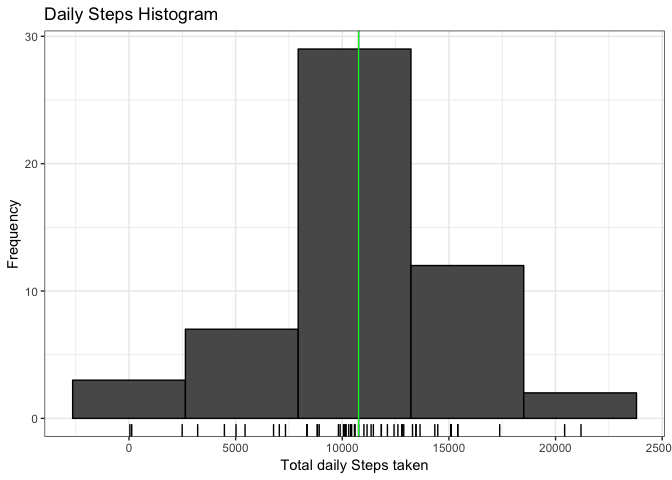
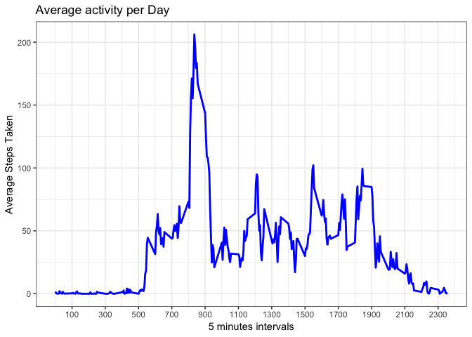
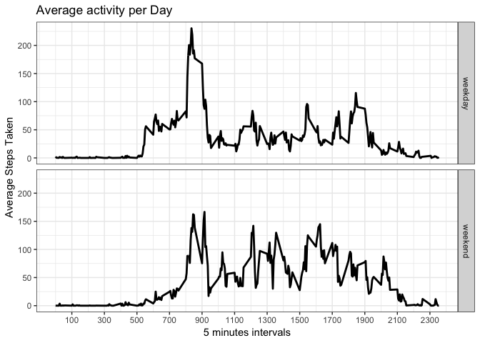

## Loading and preprocessing the data
***
Data comes on a [*zip file*](https://d396qusza40orc.cloudfront.net/repdata%2Fdata%2Factivity.zip) that needs to be extracted and then read, by source definition zip files contains an csv file so we will use **read.csv** paired with **unzip** R base function.  
Once data is read we will include present base data structure as well as simple summary of the resulting data frame for reference.

```r
activity <- read.csv(unzip("activity.zip"))
str(activity)
```

```
## 'data.frame':	17568 obs. of  3 variables:
##  $ steps   : int  NA NA NA NA NA NA NA NA NA NA ...
##  $ date    : Factor w/ 61 levels "2012-10-01","2012-10-02",..: 1 1 1 1 1 1 1 1 1 1 ...
##  $ interval: int  0 5 10 15 20 25 30 35 40 45 ...
```

```r
summary(activity)
```

```
##      steps                date          interval     
##  Min.   :  0.00   2012-10-01:  288   Min.   :   0.0  
##  1st Qu.:  0.00   2012-10-02:  288   1st Qu.: 588.8  
##  Median :  0.00   2012-10-03:  288   Median :1177.5  
##  Mean   : 37.38   2012-10-04:  288   Mean   :1177.5  
##  3rd Qu.: 12.00   2012-10-05:  288   3rd Qu.:1766.2  
##  Max.   :806.00   2012-10-06:  288   Max.   :2355.0  
##  NA's   :2304     (Other)   :15840
```

## What is mean total number of steps taken per day?
***
Assuming we ignore NA values from the resulting dataframe for the "steps" variable, and we group all observations by day computing total steps   

```r
activity1 <- activity %>% group_by(date) %>% summarise(totsteps = sum(steps))
```
we estimate that average number of steps taken by day is *10766.19* and the median is *10765.00* as shown below 

```r
mean(activity1$totsteps, na.rm = TRUE)
```

```
## [1] 10766.19
```

```r
median(activity1$totsteps, na.rm = TRUE)
```

```
## [1] 10765
```
with an acompanying distribution of frecuencas -after removing NA values- as shwon by bellow graph  

```r
hist(activity1$totsteps[!is.na(activity1$totsteps)], 
     main = "Daily Steps Histogram", 
     xlab = "Total daily Steps taken",
     col = "peachpuff")
rug(activity1$totsteps)
abline(v = mean(activity1$totsteps, na.rm = TRUE),lwd = 2, col = "blue")
```

<!-- -->

## What is the average daily activity pattern?
***
Across all 5 minute measurements taken per day, the graph that follows shows the average steps pattern ehere it can be seen that "most intense activity" happens around 9 to 10 am  

```r
activity2 <- activity %>% group_by(interval) %>% summarise(totsteps = mean(steps, na.rm = TRUE))
plot(activity2$interval, activity2$totsteps, 
     type = "l", 
     main = "Average activity per Day", 
     xlab = "5 minutes Interval", ylab = "Average Steps Count", xaxt = "n")
axis(side = 1, activity2$interval, labels=sprintf("%00i", activity2$interval), tick = FALSE)
```

<!-- -->

## Imputing missing values
***
As we saw after loading the data, there are **2304** missing "steps" values in the sample data received which is roughly **13.11%** of missing data  

```r
sum(is.na(activity$steps))
```

```
## [1] 2304
```

To avoid te issues, we will complete the missing data (NA values) with the *mean* of the 5 minutes interval for all the observations. This will be assigned to new DF  


```r
activity3 <- activity %>% group_by(interval) %>% summarise(commonsteps = mean(steps, na.rm = TRUE))
activity_isna <- activity[is.na(activity$steps),]
for(i in 1:nrow(activity_isna)) {
    activity_isna[i,1] <- activity3[activity3$interval == activity_isna[i,3],2]
    # do stuff with row
}
activity_im <- arrange(rbind(activity[!is.na(activity$steps),], activity_isna), date, interval)
sum(is.na(activity_im$steps))
```

```
## [1] 0
```

After imputing missing data using the mean values, `median` value *shifted right* towards to match previous `mean` value  

```r
mean((activity_im %>% group_by(date) %>% summarise(totsteps = sum(steps)))$totsteps)
```

```
## [1] 10766.19
```

```r
median((activity_im %>% group_by(date) %>% summarise(totsteps = sum(steps)))$totsteps)
```

```
## [1] 10766.19
```

```r
hist((activity_im %>% group_by(date) %>% summarise(totsteps = sum(steps)))$totsteps, 
     main = "Daily Steps Histogram", 
     xlab = "Total daily Steps taken",
     col = "peachpuff")
rug((activity_im %>% group_by(date) %>% summarise(totsteps = sum(steps)))$totsteps)
abline(v = mean((activity_im %>% group_by(date) %>% summarise(totsteps = sum(steps)))$totsteps, na.rm = TRUE),
       lwd = 2, col = "blue")
```

<!-- -->


## Are there differences in activity patterns between weekdays and weekends?
***

Upon classification of observations between working days and weekends and after averaging steps per interval across all observations dates we can observe that the pattern is different between weekdays (working days) and weekends as plot bellow shows   

```r
activity_im <- activity_im %>% 
                mutate(weekendlabel = as.factor(
                    if_else(weekdays(as.POSIXct(activity_im$date)) %in% c("Saturday","Sunday"),
                            "weekend","weekday")))
activity_im <- activity_im %>% 
                group_by(weekendlabel, interval) %>% summarise(totsteps = mean(steps, na.rm = TRUE))
xyplot(activity_im$totsteps ~ activity_im$interval | activity_im$weekendlabel, 
       type = "l", xlab = "5 min Intervals (24h format)", ylab = "Steps average")
```

<!-- -->


